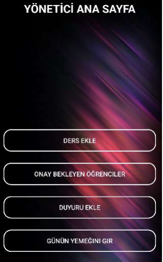
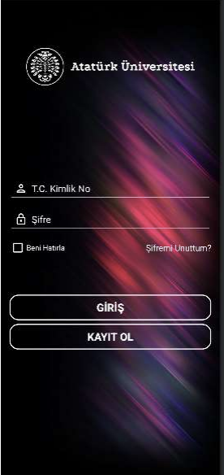
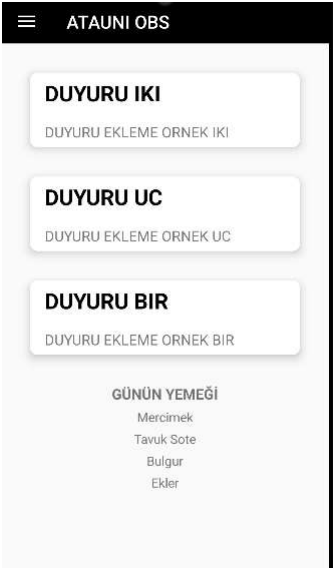
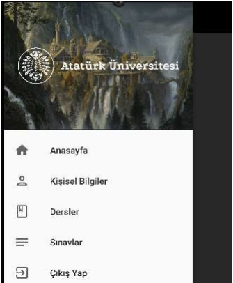

# Project Title

AtauniOBS

## Description

Ataturk University Student Information System clone.

## Getting Started

### Dependencies

* A device with a Windows operating system.

### Installing

```
git clone https://github.com/Yavuz341/AtauniOBS.git
```

### Images







## Authors

[Doğukan Yavuz](https://www.linkedin.com/in/dogukan-yavuz1/)

## Help
This is my first kotlin project. If you have suggestions and recommendations, please contact me.
